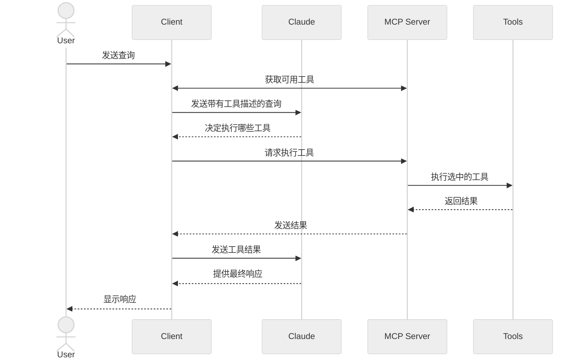

import { Grid3x3, Boxes, MessageCircle, Map } from 'lucide-react';

在本教程中，您将学习如何构建一个连接到MCP服务器的大语言模型驱动的聊天机器人客户端。建议您先完成[服务器快速入门](/quickstart/server)教程，了解构建第一个服务器的基础知识。

<Tabs items={['Python', 'Node', 'Java', 'Kotlin', 'C#']}>
<Tab value="Python">

[您可以在这里找到本教程的完整代码。](https://github.com/modelcontextprotocol/quickstart-resources/tree/main/mcp-client-python)

## 系统要求

在开始之前，请确保您的系统满足以下要求：
- Mac或Windows电脑
- 已安装最新版本的Python
- 已安装最新版本的`uv`工具

## 环境配置

首先，使用`uv`创建一个新的Python项目：

```bash
# 创建项目目录
uv init mcp-client
cd mcp-client

# 创建虚拟环境
uv venv

# 激活虚拟环境
# Windows系统：
.venv\Scripts\activate
# Unix或MacOS系统：
source .venv/bin/activate

# 安装所需的包
uv add mcp anthropic python-dotenv

# 删除模板文件
rm main.py

# 创建主文件
touch client.py
```

## 设置API密钥

您需要从[Anthropic控制台](https://console.anthropic.com/settings/keys)获取Anthropic API密钥。

创建一个`.env`文件来存储密钥：

```bash
# 创建.env文件
touch .env
```

将您的密钥添加到`.env`文件中：
```bash
ANTHROPIC_API_KEY=<在此处填入您的密钥>
```

将`.env`添加到`.gitignore`文件中：
```bash
echo ".env" >> .gitignore
```

<Callout type="warn">
请确保妥善保管您的`ANTHROPIC_API_KEY`！
</Callout>

## 创建客户端

### 基本客户端结构
首先，我们设置导入并创建基本的客户端类：

```python
import asyncio
from typing import Optional
from contextlib import AsyncExitStack

from mcp import ClientSession, StdioServerParameters
from mcp.client.stdio import stdio_client

from anthropic import Anthropic
from dotenv import load_dotenv

load_dotenv()  # 从.env加载环境变量

class MCPClient:
    def __init__(self):
        # 初始化会话和客户端对象
        self.session: Optional[ClientSession] = None
        self.exit_stack = AsyncExitStack()
        self.anthropic = Anthropic()
    # 方法将在此处添加
```

### 服务器连接管理

接下来，我们实现连接到MCP服务器的方法：

```python
async def connect_to_server(self, server_script_path: str):
    """连接到MCP服务器

    参数:
        server_script_path: 服务器脚本的路径(.py或.js)
    """
    is_python = server_script_path.endswith('.py')
    is_js = server_script_path.endswith('.js')
    if not (is_python or is_js):
        raise ValueError("服务器脚本必须是.py或.js文件")

    command = "python" if is_python else "node"
    server_params = StdioServerParameters(
        command=command,
        args=[server_script_path],
        env=None
    )

    stdio_transport = await self.exit_stack.enter_async_context(stdio_client(server_params))
    self.stdio, self.write = stdio_transport
    self.session = await self.exit_stack.enter_async_context(ClientSession(self.stdio, self.write))

    await self.session.initialize()

    # 列出可用工具
    response = await self.session.list_tools()
    tools = response.tools
    print("\n已连接到服务器，可用工具:", [tool.name for tool in tools])
```

### 查询处理逻辑

现在让我们添加处理用户查询和工具调用的核心功能：

```python
async def process_query(self, query: str) -> str:
    """使用Claude模型和MCP服务器上的可用工具处理用户查询"""
    messages = [
        {
            "role": "user",
            "content": query
        }
    ]

    response = await self.session.list_tools()
    available_tools = [{
        "name": tool.name,
        "description": tool.description,
        "input_schema": tool.inputSchema
    } for tool in response.tools]

    # 向Claude API发送初始请求
    response = self.anthropic.messages.create(
        model="claude-3-5-sonnet-20241022",
        max_tokens=1000,
        messages=messages,
        tools=available_tools
    )

    # 处理Claude响应和可能的工具调用
    final_text = []

    assistant_message_content = []
    for content in response.content:
        if content.type == 'text':
            # 处理纯文本回复
            final_text.append(content.text)
            assistant_message_content.append(content)
        elif content.type == 'tool_use':
            # 处理工具调用请求
            tool_name = content.name
            tool_args = content.input

            # 通过MCP服务器执行工具调用
            result = await self.session.call_tool(tool_name, tool_args)
            final_text.append(f"[调用工具: {tool_name}，参数: {tool_args}]")

            # 更新对话历史
            assistant_message_content.append(content)
            messages.append({
                "role": "assistant",
                "content": assistant_message_content
            })
            messages.append({
                "role": "user",
                "content": [
                    {
                        "type": "tool_result",
                        "tool_use_id": content.id,
                        "content": result.content
                    }
                ]
            })

            # 将工具执行结果发送回Claude，获取进一步回复
            response = self.anthropic.messages.create(
                model="claude-3-5-sonnet-20241022",
                max_tokens=1000,
                messages=messages,
                tools=available_tools
            )

            final_text.append(response.content[0].text)

    # 将所有回复合并为一个完整的响应
    return "\n".join(final_text)
```

### 交互式聊天界面
现在我们添加用户交互界面和资源清理功能：

```python
async def chat_loop(self):
    """运行交互式聊天循环，处理用户输入并显示回复"""
    print("\nMCP客户端已启动！")
    print("输入您的问题或输入'quit'退出。")

    while True:
        try:
            query = input("\n问题: ").strip()

            if query.lower() == 'quit':
                break

            response = await self.process_query(query)
            print("\n" + response)

        except Exception as e:
            print(f"\n错误: {str(e)}")

async def cleanup(self):
    """清理资源，关闭连接"""
    await self.exit_stack.aclose()
```

### 主入口点

最后，我们添加程序入口点和主要执行逻辑：

```python
async def main():
    if len(sys.argv) < 2:
        print("用法: python client.py <服务器脚本路径>")
        sys.exit(1)

    client = MCPClient()
    try:
        await client.connect_to_server(sys.argv[1])
        await client.chat_loop()
    finally:
        await client.cleanup()

if __name__ == "__main__":
    import sys
    asyncio.run(main())
```

您可以在[这里](https://gist.github.com/zckly/f3f28ea731e096e53b39b47bf0a2d4b1)找到完整的`client.py`文件。

## 核心组件详解

### 1. 客户端初始化
- `MCPClient`类负责初始化会话管理和API客户端
- 使用`AsyncExitStack`确保资源的正确管理和释放
- 配置Anthropic客户端以与Claude大语言模型进行交互

### 2. 服务器连接
- 支持连接Python和Node.js编写的MCP服务器
- 验证服务器脚本类型并选择适当的执行命令
- 建立与服务器的通信通道
- 初始化会话并获取可用工具列表

### 3. 查询处理
- 维护完整的对话上下文和历史记录
- 处理Claude的文本响应和工具调用指令
- 协调Claude模型和MCP工具之间的消息流
- 将多个回复整合为连贯的用户响应

### 4. 交互式界面
- 提供简洁直观的命令行交互界面
- 处理用户输入并格式化显示响应
- 包含完善的错误处理机制
- 支持通过输入'quit'优雅退出程序

### 5. 资源管理
- 确保所有资源得到妥善清理
- 提供连接问题的错误处理机制
- 实现程序的优雅关闭和资源释放

## 常见自定义点

1. **工具处理定制**
   - 可修改`process_query()`方法以支持特定类型的工具
   - 为不同工具的调用添加专门的错误处理逻辑
   - 实现针对特定工具结果的格式化处理

2. **响应处理优化**
   - 自定义不同工具结果的展示方式
   - 添加响应的过滤、转换或优化处理
   - 实现更详细的日志记录或调试信息输出

3. **用户界面增强**
   - 添加图形界面(GUI)或网页前端
   - 实现更丰富的控制台输出，如颜色、进度条等
   - 添加命令历史记录、自动补全或提示功能

## 运行客户端

要使用任何MCP服务器运行您的客户端，请执行以下命令：

```bash
uv run client.py path/to/server.py # 连接Python服务器
uv run client.py path/to/build/index.js # 连接Node服务器
```

<Callout type="info">
如果您正在继续服务器快速入门中的天气教程，您的命令可能类似于：`python client.py .../quickstart-resources/weather-server-python/weather.py`
</Callout>

客户端启动后将：
1. 自动连接到指定的MCP服务器
2. 显示所有可用的工具列表
3. 启动交互式聊天会话，您可以：
   - 输入自然语言问题和指令
   - 查看工具被调用的过程和参数
   - 获取由Claude生成的全面响应

如果您连接到服务器快速入门中的天气服务器，界面应该如下所示：

  

## 工作原理

当您向客户端提交查询时，以下流程将自动执行：

1. 客户端首先从MCP服务器获取所有可用工具的列表及其描述
2. 您的查询文本连同工具描述信息一起发送给Claude模型
3. Claude分析您的问题并决定是否需要使用特定工具
4. 如果需要使用工具，客户端将通过MCP服务器执行相应的工具调用
5. 工具执行的结果被发送回Claude进行分析和整合
6. Claude根据原始问题和工具结果生成自然语言响应
7. 最终响应展示给您，包含工具调用的信息和结果解释

## 最佳实践

1. **健壮的错误处理**
   - 始终使用try-catch块包装工具调用，避免单个工具错误导致整个会话崩溃
   - 提供具体明确的错误信息，帮助快速定位问题
   - 优雅地处理网络连接问题和服务器异常

2. **高效的资源管理**
   - 利用`AsyncExitStack`确保所有资源在使用后得到正确释放
   - 会话结束后妥善关闭所有连接
   - 实现对服务器意外断开的检测和处理机制

3. **安全最佳实践**
   - 使用`.env`文件或环境变量安全存储API密钥和敏感信息
   - 对服务器返回的结果进行验证，避免盲目信任
   - 谨慎管理工具的权限和访问范围，遵循最小权限原则

## 常见错误信息及解决方法

| 错误信息 | 可能原因 | 解决方案 |
|---------|---------|---------|
| `Connection refused` | 服务器未启动或路径错误 | 确认服务器路径正确且服务器能正常启动 |
| `Tool execution failed` | 工具执行环境配置错误 | 检查工具所需的环境变量是否正确设置 |
| `ANTHROPIC_API_KEY is not set` | API密钥未设置 | 确认环境变量中包含有效的API密钥 |
| `NoSuchElementException` | 处理空数据 | 检查数据流和工具返回值是否正确 |

## 故障排除

### 服务器路径问题
- 检查服务器脚本路径是否准确无误
- 如果相对路径不起作用，尝试使用绝对路径
- Windows用户注意：在路径中使用正斜杠(/)或成对的反斜杠(\\)
- 确认服务器文件具有正确的扩展名（Python脚本为.py，Node.js脚本为.js）

路径示例参考：
```bash
# 相对路径示例
uv run client.py ./server/weather.py

# 绝对路径示例
uv run client.py /Users/username/projects/mcp-server/weather.py

# Windows路径示例（两种格式均可）
uv run client.py C:/projects/mcp-server/weather.py
uv run client.py C:\\projects\\mcp-server\\weather.py
```

### 响应时间问题
- 首次查询的响应可能需要等待约30秒
- 这是正常现象，延迟来源于以下几个方面：
  - 服务器初始化和加载过程
  - Claude模型的处理时间
  - 工具执行和结果获取的时间
- 后续对话通常响应更快
- 请耐心等待初始响应，不要中断进程

### 常见错误及解决方法

如果您遇到以下错误：
- `FileNotFoundError`：检查服务器脚本文件路径是否正确
- `Connection refused`：确保服务器正在运行且端口未被占用
- `Tool execution failed`：检查工具所需的环境变量是否已正确设置
- `Timeout error`：可能需要在客户端配置中增加超时时间限制

</Tab>

<Tab value="Node">

[您可以在这里找到本教程的完整代码。](https://github.com/modelcontextprotocol/quickstart-resources/tree/main/mcp-client-typescript)
## 系统要求

在开始之前，请确保您的系统满足以下要求：
- Mac或Windows电脑
- 已安装Node.js 17或更高版本
- 已安装最新版本的`npm`
- Anthropic API密钥（Claude）

## 环境配置

首先，让我们创建并设置项目环境：

<Tabs items={['MacOS/Linux', 'Windows']}>
```bash tab="MacOS/Linux"
# 创建项目目录
mkdir mcp-client-typescript
cd mcp-client-typescript

# 初始化npm项目
npm init -y

# 安装依赖
npm install @anthropic-ai/sdk @modelcontextprotocol/sdk dotenv

# 安装开发依赖
npm install -D @types/node typescript

# 创建源文件
touch index.ts
```

```powershell tab="Windows"
# 创建项目目录
md mcp-client-typescript
cd mcp-client-typescript

# 初始化npm项目
npm init -y

# 安装依赖
npm install @anthropic-ai/sdk @modelcontextprotocol/sdk dotenv

# 安装开发依赖
npm install -D @types/node typescript

# 创建源文件
new-item index.ts
```
</Tabs>

更新您的`package.json`文件，设置`type: "module"`和构建脚本：

```json package.json
{
  "type": "module",
  "scripts": {
    "build": "tsc && chmod 755 build/index.js"
  }
}
```

在项目根目录创建`tsconfig.json`文件：

```json tsconfig.json
{
  "compilerOptions": {
    "target": "ES2022",
    "module": "Node16",
    "moduleResolution": "Node16",
    "outDir": "./build",
    "rootDir": "./",
    "strict": true,
    "esModuleInterop": true,
    "skipLibCheck": true,
    "forceConsistentCasingInFileNames": true
  },
  "include": ["index.ts"],
  "exclude": ["node_modules"]
}
```

## 设置API密钥

您需要从[Anthropic控制台](https://console.anthropic.com/settings/keys)获取Anthropic API密钥。

创建一个`.env`文件来安全存储密钥：

```bash
echo "ANTHROPIC_API_KEY=<在此处填入您的密钥>" > .env
```

将`.env`添加到`.gitignore`文件中以避免意外提交敏感信息：
```bash
echo ".env" >> .gitignore
```

<Callout type="warn">
请确保妥善保管您的`ANTHROPIC_API_KEY`！切勿将其提交到版本控制系统或分享给他人。
</Callout>

## 创建客户端

### 基本客户端结构

首先，在`index.ts`中导入必要模块并创建基本的客户端类：

```typescript
import { Anthropic } from "@anthropic-ai/sdk";
import {
  MessageParam,
  Tool,
} from "@anthropic-ai/sdk/resources/messages/messages.mjs";
import { Client } from "@modelcontextprotocol/sdk/client/index.js";
import { StdioClientTransport } from "@modelcontextprotocol/sdk/client/stdio.js";
import readline from "readline/promises";
import dotenv from "dotenv";

// 加载环境变量
dotenv.config();

// 获取API密钥并进行验证
const ANTHROPIC_API_KEY = process.env.ANTHROPIC_API_KEY;
if (!ANTHROPIC_API_KEY) {
  throw new Error("ANTHROPIC_API_KEY is not set");
}

class MCPClient {
  private mcp: Client;
  private anthropic: Anthropic;
  private transport: StdioClientTransport | null = null;
  private tools: Tool[] = [];

  constructor() {
    // 初始化Anthropic客户端
    this.anthropic = new Anthropic({
      apiKey: ANTHROPIC_API_KEY,
    });
    // 初始化MCP客户端
    this.mcp = new Client({ name: "mcp-client-cli", version: "1.0.0" });
  }
  // 方法将在此处添加
}
```

### 服务器连接管理

接下来，我们实现连接到MCP服务器并获取可用工具的方法：

```typescript
async connectToServer(serverScriptPath: string) {
  try {
    // 检测服务器脚本类型
    const isJs = serverScriptPath.endsWith(".js");
    const isPy = serverScriptPath.endsWith(".py");
    if (!isJs && !isPy) {
      throw new Error("服务器脚本必须是.js或.py文件");
    }
    
    // 根据操作系统和脚本类型选择合适的命令
    const command = isPy
      ? process.platform === "win32"
        ? "python"
        : "python3"
      : process.execPath;
    
    // 创建与服务器的传输连接
    this.transport = new StdioClientTransport({
      command,
      args: [serverScriptPath],
    });
    this.mcp.connect(this.transport);
    
    // 获取服务器提供的工具列表
    const toolsResult = await this.mcp.listTools();
    this.tools = toolsResult.tools.map((tool) => {
      return {
        name: tool.name,
        description: tool.description,
        input_schema: tool.inputSchema,
      };
    });
    
    // 显示已连接的工具信息
    console.log(
      "已连接到服务器，可用工具:",
      this.tools.map(({ name }) => name)
    );
  } catch (e) {
    console.log("连接到MCP服务器失败: ", e);
    throw e;
  }
}
```

### 查询处理逻辑

现在让我们添加处理用户查询和工具调用的核心功能：

```typescript
async processQuery(query: string) {
  // 创建初始消息，包含用户查询
  const messages: MessageParam[] = [
    {
      role: "user",
      content: query,
    },
  ];

  // 向Claude API发送初始请求，包含工具信息
  const response = await this.anthropic.messages.create({
    model: "claude-3-5-sonnet-20241022",
    max_tokens: 1000,
    messages,
    tools: this.tools,
  });

  // 用于存储所有响应文本和工具结果
  const finalText = [];
  const toolResults = [];

  // 处理Claude的响应内容
  for (const content of response.content) {
    if (content.type === "text") {
      // 处理纯文本响应
      finalText.push(content.text);
    } else if (content.type === "tool_use") {
      // 处理工具调用请求
      const toolName = content.name;
      const toolArgs = content.input as { [x: string]: unknown } | undefined;

      // 通过MCP服务器执行工具调用
      const result = await this.mcp.callTool({
        name: toolName,
        arguments: toolArgs,
      });
      toolResults.push(result);
      finalText.push(
        `[调用工具: ${toolName}，参数: ${JSON.stringify(toolArgs)}]`
      );

      // 将工具执行结果添加到对话历史
      messages.push({
        role: "user",
        content: result.content as string,
      });

      // 将工具结果发送回Claude，获取进一步回复
      const response = await this.anthropic.messages.create({
        model: "claude-3-5-sonnet-20241022",
        max_tokens: 1000,
        messages,
      });

      // 添加Claude对工具结果的解释
      finalText.push(
        response.content[0].type === "text" ? response.content[0].text : ""
      );
    }
  }

  // 合并所有响应为一个完整的文本
  return finalText.join("\n");
}
```

### 交互式聊天界面

现在我们添加用户交互界面和资源清理功能：

```typescript
async chatLoop() {
  // 创建命令行交互界面
  const rl = readline.createInterface({
    input: process.stdin,
    output: process.stdout,
  });

  try {
    console.log("\nMCP客户端已启动！");
    console.log("输入您的问题或输入'quit'退出。");

    // 开始交互循环
    while (true) {
      const message = await rl.question("\n问题: ");
      if (message.toLowerCase() === "quit") {
        break;
      }
      const response = await this.processQuery(message);
      console.log("\n" + response);
    }
  } finally {
    // 确保关闭readline接口
    rl.close();
  }
}

async cleanup() {
  // 关闭MCP客户端连接
  await this.mcp.close();
}
```

### 主入口点

最后，我们添加程序入口点和主要执行逻辑：

```typescript
async function main() {
  // 验证命令行参数
  if (process.argv.length < 3) {
    console.log("用法: node index.ts <服务器脚本路径>");
    return;
  }
  
  // 创建并运行MCP客户端
  const mcpClient = new MCPClient();
  try {
    await mcpClient.connectToServer(process.argv[2]);
    await mcpClient.chatLoop();
  } finally {
    // 确保资源被正确清理
    await mcpClient.cleanup();
    process.exit(0);
  }
}

main();
```

## 运行客户端

要使用任何MCP服务器运行您的客户端，请执行以下命令：

```bash
# 构建TypeScript代码
npm run build

# 运行客户端
node build/index.js path/to/server.py # 连接Python服务器
node build/index.js path/to/build/index.js # 连接Node服务器
```

<Callout type="info">
如果您正在继续服务器快速入门中的天气教程，您的命令可能类似于：`node build/index.js .../quickstart-resources/weather-server-typescript/build/index.js`
</Callout>

**客户端启动后将：**
1. 自动连接到指定的MCP服务器
2. 获取并显示所有可用的工具列表
3. 启动交互式聊天会话，您可以：
   - 输入自然语言问题和指令
   - 查看工具被调用的过程和参数
   - 获取由Claude生成的全面响应

## 工作原理

当您向客户端提交查询时，以下流程将自动执行：

1. 客户端首先从MCP服务器获取所有可用工具的列表及其描述
2. 您的查询文本连同工具描述信息一起发送给Claude模型
3. Claude分析您的问题并决定是否需要使用特定工具
4. 如果需要使用工具，客户端将通过MCP服务器执行相应的工具调用
5. 工具执行的结果被发送回Claude进行分析和整合
6. Claude根据原始问题和工具结果生成自然语言响应
7. 最终响应展示给您，包含工具调用的信息和结果解释

## 最佳实践

1. **类型安全与错误处理**
   - 充分利用TypeScript的类型系统，提前发现潜在问题
   - 使用try-catch块包装工具调用和API请求，避免单点故障
   - 提供清晰明确的错误信息，方便排查和修复
   - 实现优雅的异常处理机制，确保程序在各种异常情况下的稳定性

2. **安全性考虑**
   - 使用`.env`文件或环境变量安全存储API密钥和敏感信息
   - 对服务器返回的数据进行验证，防止恶意输入或意外结果
   - 遵循最小权限原则，谨慎管理工具的权限访问范围
   - 定期更新依赖项，修复已知的安全漏洞

## 故障排除

### 服务器路径问题
- 检查服务器脚本路径是否准确无误，尤其是相对路径的使用
- 如果相对路径不起作用，尝试使用绝对路径代替
- Windows用户注意：在路径中使用正斜杠(/)或成对的反斜杠(\\)
- 确认服务器文件具有正确的扩展名（Node.js脚本为.js，Python脚本为.py）

路径示例参考：
```bash
# 相对路径示例
node build/index.js ./server/build/index.js

# 绝对路径示例
node build/index.js /Users/username/projects/mcp-server/build/index.js

# Windows路径示例（两种格式均可）
node build/index.js C:/projects/mcp-server/build/index.js
node build/index.js C:\\projects\\mcp-server\\build\\index.js
```

### 响应时间
- 首次查询的响应可能需要等待约30秒
- 这是正常现象，在以下过程中会发生：
  - 服务器初始化
  - Claude处理查询
  - 工具正在执行
- 后续响应通常会更快
- 在初始等待期间不要中断进程

### 常见错误消息

如果您看到：
- `Error: Cannot find module`：检查构建过程是否成功，确认build文件夹中包含所有编译后的文件
- `Connection refused`：确保服务器正在运行，且指定的端口未被其他程序占用
- `Tool execution failed`：检查工具所需的环境变量是否已正确设置
- `ANTHROPIC_API_KEY is not set`：确认.env文件存在且包含有效的API密钥
- `TypeError`：检查工具参数类型是否正确，尤其是复杂对象的结构

</Tab>


<Tab value="Java">

<Callout type="info">
这是一个基于Spring AI MCP自动配置和启动器的快速入门示例。
如果您想了解如何手动创建同步和异步MCP客户端，请参阅[Java SDK客户端](/sdk/java/mcp-client)文档。
</Callout>

本示例将教您如何构建一个智能聊天机器人，它结合了Spring AI框架、模型上下文协议(MCP)和[Brave搜索服务器](https://github.com/modelcontextprotocol/servers/tree/main/src/brave-search)。这个应用程序创建了一个智能交互界面，由Anthropic的Claude AI模型提供支持，并能够通过Brave搜索实时获取互联网信息，让您可以用自然语言方式与网络数据进行交互。

[完整代码示例请查看这里](https://github.com/spring-projects/spring-ai-examples/tree/main/model-context-protocol/web-search/brave-chatbot)

## 系统要求

开始前，请确保您的系统满足以下条件：
- Java 17或更高版本
- Maven 3.6+
- npx包管理工具
- Anthropic API密钥（用于访问Claude）
- Brave搜索API密钥

## 环境配置

请按照以下步骤设置您的环境：

1. 安装npx（Node Package eXecute）：
   首先确保您已安装[npm](https://docs.npmjs.com/downloading-and-installing-node-js-and-npm)，
   然后执行：
   ```bash
   npm install -g npx
   ```

2. 克隆示例代码仓库：
   ```bash
   git clone https://github.com/spring-projects/spring-ai-examples.git
   cd model-context-protocol/brave-chatbot
   ```

3. 设置必要的API密钥：
   ```bash
   export ANTHROPIC_API_KEY='您的Anthropic API密钥'
   export BRAVE_API_KEY='您的Brave搜索API密钥'
   ```

4. 构建项目：
   ```bash
   ./mvnw clean install
   ```

5. 运行应用程序：
   ```bash
   ./mvnw spring-boot:run
   ```

<Callout type="warn">
请务必妥善保管您的API密钥！不要将它们公开分享或提交到代码仓库中。
</Callout>


## 工作原理

该应用程序通过以下组件将Spring AI与Brave搜索MCP服务器无缝集成：

### 1. MCP客户端配置

首先，在pom.xml中添加必要的依赖项：
```xml
<dependency>
    <groupId>org.springframework.ai</groupId>
    <artifactId>spring-ai-starter-mcp-client</artifactId>
</dependency>
<dependency>
    <groupId>org.springframework.ai</groupId>
    <artifactId>spring-ai-starter-model-anthropic</artifactId>
</dependency>
```

然后，在application.yml中配置应用程序属性：
```yml
spring:
  ai:
    mcp:
      client:
        enabled: true
        name: brave-search-client
        version: 1.0.0
        type: SYNC
        request-timeout: 20s
        stdio:
          root-change-notification: true
          servers-configuration: classpath:/mcp-servers-config.json
    anthropic:
      api-key: ${ANTHROPIC_API_KEY}
```

这些配置会激活`spring-ai-starter-mcp-client`启动器，它会根据提供的服务器配置自动创建一个或多个`McpClient`实例。

最后，创建MCP服务器配置文件`mcp-servers-config.json`：
```json
{
  "mcpServers": {
    "brave-search": {
      "command": "npx",
      "args": [
        "-y",
        "@modelcontextprotocol/server-brave-search"
      ],
      "env": {
        "BRAVE_API_KEY": "您的BRAVE API密钥"
      }
    }
  }
}
```

### 2. 聊天机器人实现

聊天机器人使用Spring AI的ChatClient来集成MCP工具：

```java
var chatClient = chatClientBuilder
    .defaultSystem("你是一个有用的助手，精通AI和Java技术。")
    .defaultTools((Object[]) mcpToolAdapter.toolCallbacks())
    .defaultAdvisors(new MessageChatMemoryAdvisor(new InMemoryChatMemory()))
    .build();
```

核心功能特点：
- **智能理解**：利用Claude AI模型进行自然语言理解和处理
- **实时搜索**：通过MCP协议集成Brave搜索，获取最新网络信息
- **记忆功能**：使用InMemoryChatMemory保持对话上下文和历史
- **简洁界面**：提供交互式命令行界面，方便用户提问和获取回答

### 3. 构建和运行

完成配置后，您可以通过以下命令构建并运行应用：

```bash
./mvnw clean install
java -jar ./target/ai-mcp-brave-chatbot-0.0.1-SNAPSHOT.jar
```

或者直接使用Maven运行：

```bash
./mvnw spring-boot:run
```

应用启动后，您将进入一个交互式聊天会话。当您提出问题时，聊天机器人会：
- 使用内置知识回答一般性问题
- 必要时通过Brave搜索获取最新网络信息
- 记住您之前的对话内容，提供连贯的回答
- 整合多种信息源，生成全面而准确的回答

### 4. 高级配置选项

MCP客户端还支持多种高级配置：

- **客户端定制**：通过`McpSyncClientCustomizer`或`McpAsyncClientCustomizer`接口自定义客户端行为
- **多客户端支持**：同时使用多个MCP客户端，支持不同的传输类型
- **传输类型**：支持`STDIO`（标准输入输出）和`SSE`（服务器发送事件）两种传输方式
- **自动化管理**：自动处理客户端的初始化和生命周期管理

对于生产环境中的Web应用程序，推荐使用基于WebFlux的启动器：

```xml
<dependency>
    <groupId>org.springframework.ai</groupId>
    <artifactId>spring-ai-mcp-client-webflux-spring-boot-starter</artifactId>
</dependency>
```

这个启动器提供了类似的功能，但使用了基于WebFlux的SSE传输实现，更适合生产环境部署，提供更好的性能和可扩展性。

</Tab>

<Tab value="Kotlin">

[您可以在这里找到本教程的完整代码。](https://github.com/modelcontextprotocol/kotlin-sdk/tree/main/samples/kotlin-mcp-client)

## 系统要求

在开始之前，请确保您的系统满足以下条件：
- Java 17或更高版本
- Anthropic API密钥（用于访问Claude模型）

## 环境配置

首先，如果您尚未安装`java`和`gradle`，请先完成这些基础环境的安装。
您可以从[Oracle JDK官方网站](https://www.oracle.com/java/technologies/downloads/)下载并安装`java`。
安装完成后，执行以下命令验证Java安装是否成功：
```bash
java --version
```

接下来，让我们创建并设置项目：

<Tabs items={['MacOS/Linux', 'Windows']}>
```bash tab="MacOS/Linux"
# 创建项目目录
mkdir kotlin-mcp-client
cd kotlin-mcp-client

# 初始化Kotlin项目
gradle init
```

```powershell tab="Windows"
# 创建项目目录
md kotlin-mcp-client
cd kotlin-mcp-client
# 初始化Kotlin项目
gradle init
```
</Tabs>

运行`gradle init`后，系统会显示项目创建选项。请按照以下选择进行操作：
- 项目类型选择**Application**
- 编程语言选择**Kotlin**
- Java版本选择**Java 17**

如果您更习惯使用IDE创建项目，也可以使用[IntelliJ IDEA项目向导](https://kotlinlang.org/docs/jvm-get-started.html)快速创建Kotlin应用程序。

创建项目后，需要添加以下依赖项：

<Tabs items={['build.gradle.kts', 'build.gradle']}>
```kotlin tab="build.gradle.kts"
val mcpVersion = "0.4.0"
val slf4jVersion = "2.0.9"
val anthropicVersion = "0.8.0"

dependencies {
    implementation("io.modelcontextprotocol:kotlin-sdk:$mcpVersion")
    implementation("org.slf4j:slf4j-nop:$slf4jVersion")
    implementation("com.anthropic:anthropic-java:$anthropicVersion")
}
```

```groovy tab="build.gradle"
def mcpVersion = '0.3.0'
def slf4jVersion = '2.0.9'
def anthropicVersion = '0.8.0'
dependencies {
    implementation "io.modelcontextprotocol:kotlin-sdk:$mcpVersion"
    implementation "org.slf4j:slf4j-nop:$slf4jVersion"
    implementation "com.anthropic:anthropic-java:$anthropicVersion"
}
```
</Tabs>

此外，请在构建脚本中添加Shadow插件，用于创建包含所有依赖的fat JAR包：
<Tabs items={['build.gradle.kts', 'build.gradle']}>
```kotlin tab="build.gradle.kts"
plugins {
    id("com.github.johnrengelman.shadow") version "8.1.1"
}
```

```groovy tab="build.gradle"
plugins {
    id 'com.github.johnrengelman.shadow' version '8.1.1'
}
```
</Tabs>

## 设置API密钥

您需要从[Anthropic控制台](https://console.anthropic.com/settings/keys)获取Anthropic API密钥。

获取密钥后，通过环境变量设置：
```bash
export ANTHROPIC_API_KEY='您的API密钥'
```

<Callout type="warn">
安全提示：请妥善保管您的API密钥！不要将其提交到代码仓库或分享给他人。
</Callout>

## 创建客户端

### 基本客户端结构

首先，让我们创建基本的客户端类：

```kotlin
class MCPClient : AutoCloseable {
    private val anthropic = AnthropicOkHttpClient.fromEnv()
    private val mcp: Client = Client(clientInfo = Implementation(name = "mcp-client-cli", version = "1.0.0"))
    private lateinit var tools: List<ToolUnion>

    // 后续将在此处添加具体方法

    override fun close() {
        runBlocking {
            mcp.close()
            anthropic.close()
        }
    }
```

### 服务器连接管理

接下来，我们实现连接到MCP服务器的方法：

```kotlin
suspend fun connectToServer(serverScriptPath: String) {
    try {
        // 根据脚本类型选择合适的命令
        val command = buildList {
            when (serverScriptPath.substringAfterLast(".")) {
                "js" -> add("node")
                "py" -> add(if (System.getProperty("os.name").lowercase().contains("win")) "python" else "python3")
                "jar" -> addAll(listOf("java", "-jar"))
                else -> throw IllegalArgumentException("服务器脚本必须是.js、.py或.jar文件")
            }
            add(serverScriptPath)
        }

        // 启动服务器进程并建立通信
        val process = ProcessBuilder(command).start()
        val transport = StdioClientTransport(
            input = process.inputStream.asSource().buffered(),
            output = process.outputStream.asSink().buffered()
        )

        // 连接到MCP服务器
        mcp.connect(transport)

        // 获取可用工具列表
        val toolsResult = mcp.listTools()
        tools = toolsResult?.tools?.map { tool ->
            ToolUnion.ofTool(
                Tool.builder()
                    .name(tool.name)
                    .description(tool.description ?: "")
                    .inputSchema(
                        Tool.InputSchema.builder()
                            .type(JsonValue.from(tool.inputSchema.type))
                            .properties(tool.inputSchema.properties.toJsonValue())
                            .putAdditionalProperty("required", JsonValue.from(tool.inputSchema.required))
                            .build()
                    )
                    .build()
            )
        } ?: emptyList()
        println("已连接到服务器，可用工具: ${tools.joinToString(", ") { it.tool().get().name() }}")
    } catch (e: Exception) {
        println("连接到MCP服务器失败: $e")
        throw e
    }
}
```

还需创建一个辅助函数，用于将`JsonObject`转换为Anthropic API所需的`JsonValue`格式：
```kotlin
private fun JsonObject.toJsonValue(): JsonValue {
    val mapper = ObjectMapper()
    val node = mapper.readTree(this.toString())
    return JsonValue.fromJsonNode(node)
}
```

### 查询处理逻辑

现在让我们添加处理用户查询和工具调用的核心功能：

```kotlin
private val messageParamsBuilder: MessageCreateParams.Builder = MessageCreateParams.builder()
    .model(Model.CLAUDE_3_5_SONNET_20241022)
    .maxTokens(1024)

suspend fun processQuery(query: String): String {
    // 创建初始用户消息
    val messages = mutableListOf(
        MessageParam.builder()
            .role(MessageParam.Role.USER)
            .content(query)
            .build()
    )

    // 向Claude发送初始请求，包含工具信息
    val response = anthropic.messages().create(
        messageParamsBuilder
            .messages(messages)
            .tools(tools)
            .build()
    )

    // 处理Claude的响应内容
    val finalText = mutableListOf<String>()
    response.content().forEach { content ->
        when {
            // 处理纯文本响应
            content.isText() -> finalText.add(content.text().getOrNull()?.text() ?: "")

            // 处理工具调用
            content.isToolUse() -> {
                val toolName = content.toolUse().get().name()
                val toolArgs =
                    content.toolUse().get()._input().convert(object : TypeReference<Map<String, JsonValue>>() {})

                // 通过MCP服务器执行工具
                val result = mcp.callTool(
                    name = toolName,
                    arguments = toolArgs ?: emptyMap()
                )
                finalText.add("[调用工具: ${toolName}，参数: ${toolArgs}]")

                // 将工具执行结果添加到对话历史
                messages.add(
                    MessageParam.builder()
                        .role(MessageParam.Role.USER)
                        .content(
                            """
                                "type": "tool_result",
                                "tool_name": $toolName,
                                "result": ${result?.content?.joinToString("\n") { (it as TextContent).text ?: "" }}
                            """.trimIndent()
                        )
                        .build()
                )

                // 将工具结果发送回Claude获取进一步解释
                val aiResponse = anthropic.messages().create(
                    messageParamsBuilder
                        .messages(messages)
                        .build()
                )

                finalText.add(aiResponse.content().first().text().getOrNull()?.text() ?: "")
            }
        }
    }

    // 合并所有回复为一个完整的响应
    return finalText.joinToString("\n", prefix = "", postfix = "")
}
```

### 交互式聊天界面

我们添加用户交互界面：

```kotlin
suspend fun chatLoop() {
    println("\nMCP客户端已启动！")
    println("输入您的问题或输入'quit'退出。")

    while (true) {
        print("\n问题: ")
        val message = readLine() ?: break
        if (message.lowercase() == "quit") break
        
        // 处理用户查询并显示响应
        val response = processQuery(message)
        println("\n$response")
    }
}
```

### 主入口点

最后，我们添加程序入口点和主要执行逻辑：

```kotlin
fun main(args: Array<String>) = runBlocking {
    if (args.isEmpty()) throw IllegalArgumentException("用法: java -jar <项目路径>/build/libs/kotlin-mcp-client-0.1.0-all.jar <服务器脚本路径>")
    val serverPath = args.first()
    val client = MCPClient()
    client.use {
        client.connectToServer(serverPath)
        client.chatLoop()
    }
}
```

## 运行客户端

要使用MCP服务器运行您的客户端，请执行以下命令：

```bash
# 构建项目生成JAR包
./gradlew build

# 运行客户端连接不同类型的服务器
java -jar build/libs/<您的jar文件名>.jar path/to/server.jar   # 连接Java服务器
java -jar build/libs/<您的jar文件名>.jar path/to/server.py    # 连接Python服务器
java -jar build/libs/<您的jar文件名>.jar path/to/index.js     # 连接Node.js服务器
```

<Callout type="info">
如果您正在继续服务器快速入门中的天气教程，您的命令可能类似于：
`java -jar build/libs/kotlin-mcp-client-0.1.0-all.jar .../samples/weather-stdio-server/build/libs/weather-stdio-server-0.1.0-all.jar`
</Callout>

**客户端启动后会自动执行以下步骤：**
1. 连接到指定的MCP服务器
2. 获取并显示可用工具列表
3. 启动交互式聊天会话，您可以：
   - 使用自然语言提问
   - 观察工具调用过程和结果
   - 获取由Claude生成的综合回答

## 工作原理

以下是客户端的工作流程图：



当用户提交查询时，系统会执行以下处理流程：
1. 客户端首先获取服务器上所有可用工具的描述
2. 将用户查询和工具描述一起发送给Claude模型
3. Claude分析查询内容并决定是否需要调用特定工具
4. 如需使用工具，客户端通过MCP服务器执行相应工具调用
5. 结果发送回Claude进行处理和分析
6. Claude基于原始查询和工具结果生成完整回答
7. 最终的回答显示给用户，包含工具调用信息和结果解释

## 最佳实践

1. **错误处理**
   - 利用Kotlin的类型系统明确地建模错误
   - 在可能出现异常的地方使用`try-catch`块包装外部工具和API调用
   - 提供清晰、有意义的错误消息
   - 优雅地处理网络超时和连接问题

2. **安全性**
   - 在`local.properties`、环境变量或密钥管理器中安全地存储API密钥和敏感信息
   - 对服务器返回的数据进行验证，防止恶意输入或意外结果
   - 使用工具时谨慎处理权限和信任边界
   - 定期更新依赖项，修复已知的安全漏洞

## 故障排除

### 服务器路径问题
- 仔细检查服务器脚本路径是否正确
- 如果相对路径不起作用，请使用绝对路径
- 对于Windows用户，确保在路径中使用正斜杠(/)或转义的反斜杠(\\)
- 确认已安装所需的运行时环境（Java用于Java，npm用于Node.js，或uv用于Python）
- 验证服务器文件具有正确的扩展名（Java为.jar，Node.js为.js，Python为.py）

正确路径用法示例：
```bash
# 相对路径
java -jar build/libs/client.jar ./server/build/libs/server.jar

# 绝对路径
java -jar build/libs/client.jar /Users/username/projects/mcp-server/build/libs/server.jar

# Windows路径（两种格式均可）
java -jar build/libs/client.jar C:/projects/mcp-server/build/libs/server.jar
java -jar build/libs/client.jar C:\\projects\\mcp-server\\build\\libs\\server.jar
```

### 响应时间
- 第一个响应可能需要长达30秒才能返回
- 这是正常现象，在以下过程中会发生：
  - 服务器初始化
  - Claude处理查询
  - 工具正在执行
- 后续响应通常会更快
- 在初始等待期间不要中断进程

## 常见错误信息及解决方法

| 错误信息 | 可能原因 | 解决方案 |
|---------|---------|---------|
| `Connection refused` | 服务器未启动或路径错误 | 确认服务器路径正确且服务器能正常启动 |
| `Tool execution failed` | 工具执行环境配置错误 | 检查工具所需的环境变量是否正确设置 |
| `ANTHROPIC_API_KEY is not set` | API密钥未设置 | 确认环境变量中包含有效的API密钥 |
| `NoSuchElementException` | 处理空数据 | 检查数据流和工具返回值是否正确 |

</Tab>

<Tab value="C#">
[您可以在这里找到本教程的完整代码。](https://github.io/modelcontextprotocol/csharp-sdk/tree/main/samples/QuickstartClient)

## 系统要求

开始前，请确保您的系统满足以下条件：
- .NET 8.0或更高版本
- Anthropic API密钥（用于访问Claude模型）
- Windows、Linux或MacOS操作系统

## 环境配置

首先，创建一个新的.NET项目：
```bash
dotnet new console -n QuickstartClient
cd QuickstartClient
```

然后，为您的项目添加所需的依赖项：
```bash
dotnet add package ModelContextProtocol --prerelease
dotnet add package Anthropic.SDK
dotnet add package Microsoft.Extensions.Hosting
```

## 设置API密钥

您需要从[Anthropic控制台](https://console.anthropic.com/settings/keys)获取Anthropic API密钥。

使用.NET用户机密功能安全存储您的API密钥：
```bash
dotnet user-secrets init
dotnet user-secrets set "ANTHROPIC_API_KEY" "您的API密钥"
```

## 创建客户端

### 基本客户端结构

首先，创建应用程序的基本框架，设置配置和依赖注入：

```csharp
using Microsoft.Extensions.Configuration;
using Microsoft.Extensions.Hosting;

var builder = Host.CreateEmptyApplicationBuilder(settings: null);

// 添加用户机密配置
builder.Configuration
    .AddUserSecrets<Program>();
```

这段代码创建了一个基础的.NET应用程序框架，并从用户机密存储中加载API密钥。

接下来，我们设置MCP客户端连接：

```csharp
// 根据服务器脚本类型选择合适的命令
var (command, arguments) = args switch
{
    [var script] when script.EndsWith(".py") => ("python", script),
    [var script] when script.EndsWith(".js") => ("node", script),
    [var script] when Directory.Exists(script) || (File.Exists(script) && script.EndsWith(".csproj")) => ("dotnet", $"run --project {script} --no-build"),
    _ => throw new NotSupportedException("提供了不支持的服务器脚本。支持的脚本类型包括.py、.js或.csproj")
};

// 创建并配置MCP客户端
await using var mcpClient = await McpClientFactory.CreateAsync(new()
{
    Id = "demo-server",
    Name = "Demo Server",
    TransportType = TransportTypes.StdIo,
    TransportOptions = new()
    {
        ["command"] = command,
        ["arguments"] = arguments,
    }
});

// 获取服务器提供的工具列表
var tools = await mcpClient.ListToolsAsync();
foreach (var tool in tools)
{
    Console.WriteLine($"已连接到服务器，可用工具: {tool.Name}");
}
```

<Callout type="info">
请确保添加必要的命名空间引用：
```csharp
using ModelContextProtocol.Client;
using ModelContextProtocol.Protocol.Transport;
```
</Callout>

这段代码会根据命令行参数指定的服务器脚本类型，自动选择适当的命令启动服务器，然后建立客户端连接并获取可用工具列表。

### 查询处理逻辑

现在，我们实现处理用户查询和工具调用的核心功能：

```csharp
// 创建并配置Anthropic聊天客户端
using IChatClient anthropicClient = new AnthropicClient(new APIAuthentication(builder.Configuration["ANTHROPIC_API_KEY"]))
    .Messages
    .AsBuilder()
    .UseFunctionInvocation()  // 启用函数调用功能
    .Build();

// 设置聊天选项
var options = new ChatOptions
{
    MaxOutputTokens = 1000,
    ModelId = "claude-3-5-sonnet-20241022",
    Tools = [.. tools]  // 将MCP工具传递给Claude模型
};

// 开始交互式聊天循环
while (true)
{
    Console.WriteLine("\nMCP客户端已启动！");
    Console.WriteLine("输入您的问题或输入'quit'退出。");

    string? query = Console.ReadLine();

    // 处理空输入
    if (string.IsNullOrWhiteSpace(query))
    {
        continue;
    }
    // 检查退出命令
    if (string.Equals(query, "quit", StringComparison.OrdinalIgnoreCase))
    {
        break;
    }

    // 获取流式响应
    var response = anthropicClient.GetStreamingResponseAsync(query, options);

    // 实时显示响应内容
    await foreach (var message in response)
    {
        Console.Write(message.Text);
    }
    Console.WriteLine();
}
```

## 核心组件详解

### 1. 客户端初始化
* 客户端使用`McpClientFactory.CreateAsync()`初始化，该方法设置传输类型和运行服务器的命令。

### 2. 服务器连接
* 支持Python、Node.js和.NET服务器。
* 服务器使用参数中指定的命令启动。
* 配置使用stdio与服务器通信。
* 初始化会话和可用工具。

### 3. 查询处理
* 利用[Microsoft.Extensions.AI](https://learn.microsoft.com/dotnet/ai/ai-extensions)作为聊天客户端。
* 配置`IChatClient`使用自动工具（函数）调用。
* 客户端读取用户输入并将其发送到服务器。
* 服务器处理查询并返回响应。
* 响应显示给用户。

## 运行客户端

要使用MCP服务器运行您的客户端，请执行以下命令：

```bash
# 运行客户端并连接到不同类型的服务器
dotnet run -- path/to/server.csproj  # 连接.NET服务器
dotnet run -- path/to/server.py      # 连接Python服务器
dotnet run -- path/to/server.js      # 连接Node.js服务器
```

<Callout type="info">
如果您正在继续服务器快速入门中的天气教程，您的命令可能类似于：
`dotnet run -- path/to/QuickstartWeatherServer`
</Callout>

**客户端启动后会自动执行以下步骤：**

1. 连接到指定的MCP服务器
2. 获取并显示可用工具列表
3. 启动交互式聊天会话，您可以：
   - 使用自然语言提问
   - 观察工具调用过程
   - 获取由Claude生成的智能回答
4. 输入'quit'可随时退出程序

下面是连接到天气服务器后的示例界面：

  

</Tab>

</Tabs>

## 下一步

<Cards cols={2}>
  <Card
    title="示例服务器"
    icon={<Grid3x3 />}
    href="/examples"
  >
    查看我们的官方MCP服务器和实现示例库
  </Card>
  <Card
    title="客户端"
    icon={<Boxes />}
    href="/clients"
  >
    浏览支持MCP集成的客户端列表
  </Card>
  <Card
    title="使用大语言模型构建MCP"
    icon={<MessageCircle />}
    href="/tutorials/building-mcp-with-llms"
  >
    了解如何使用Claude等大语言模型加速MCP开发
  </Card>
   <Card
    title="核心架构"
    icon={<Map />}
    href="/docs/concepts/architecture"
  >
    理解MCP如何连接客户端、服务器和大语言模型
  </Card>
</Cards>